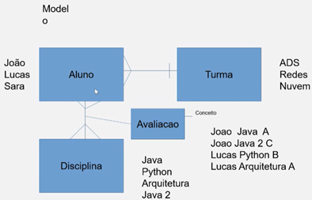
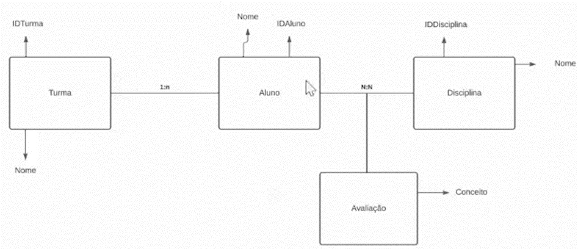
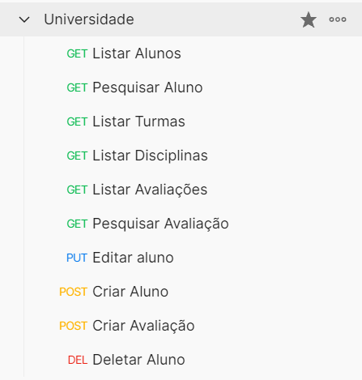

# API Universidade

### API desenvolvida em JAVA utilizando o framework SPRING
#### ImpulsoTec, 2022 - Trilha Backend (iniciativa Accenture/Itaú/Aws).

Baixe o <b><a href="https://github.com/ManoelPradoMark22/API-JAVA-spring-Universidade/blob/master/Universidade.postman_collection.json">ARQUIVO POSTMAN</a></b> para testar as rotas

---

